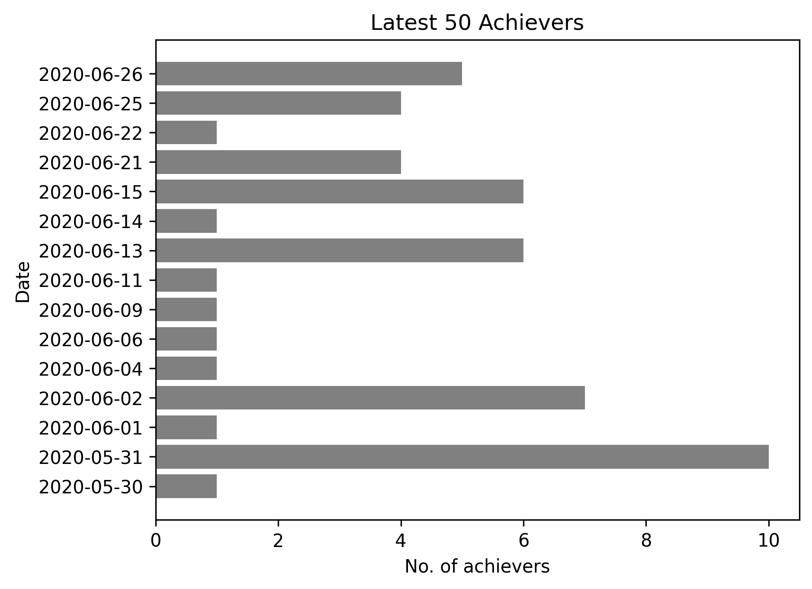

## Overview

Observing [FIRE UP THAT CAR... AGAIN](https://psnprofiles.com/trophy/8745-dirt-rally-20/9-fire-up-that-car-again) from Dirt Rally 2.0 for anomaly in Latest 50 Achievers. When an anomaly is detected, it (most probably) means that the Delta Daily event was on that date.

## Quick Start

1. `git clone git@github.com:siggb/dirtrally2-observer.git`

2. `./bootstrap.sh` *(check what's inside first, and change if needed)*

3. `pipenv shell` > `python src/main.py` > `exit`

## Horizontal Bar Chart with Results

